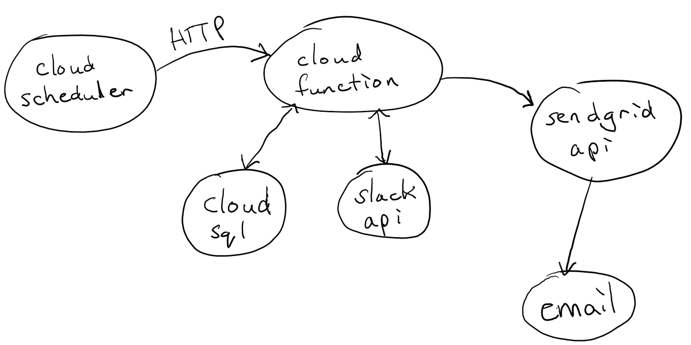

# emoji-alert

Slack new custom emoji alert



### Requirements

- `terraform >= 0.12.x`
- `PostgreSQL 11`
- `gcloud`
- Slack API key
- SendGrid API key

### Initialization

```sh
make init
```

### Provision resources and/or update deployed code

```sh
make deploy
```

#### Table must be created in database before use
```
gcloud sql connect emoji-alert-instance --user=postgres --quiet
```
```sh
> \c emoji-alert
> CREATE TABLE emojis (
>     name VARCHAR, 
>     img_url VARCHAR,
>     PRIMARY KEY(name)
> );
> \q
```